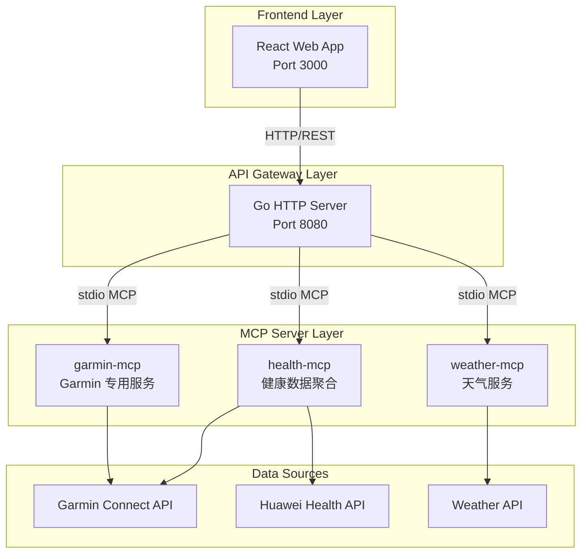

# HomeMate Server v3.0

HomeMate 是一款面向家庭的智能生活助理应用，通过 MCP（Model Context Protocol）服务器集成多种数据源，为家庭成员提供统一的健康数据管理、天气查询和 AI 对话服务。

## Overview

HomeMate v3.0 采用模块化架构设计，核心特性包括：

- **多成员家庭管理**：支持多个家庭成员的健康数据追踪
- **MCP 服务器生态**：通过标准化的 MCP 协议连接 Garmin、华为等健康设备
- **AI 智能助手**：基于大语言模型的家庭对话助手
- **响应式 Web 前端**：基于 React + Tailwind CSS 的现代化界面
- **多阶段容器化部署**：优化的 Docker 构建流程

## Architecture



## Quick Start

### Prerequisites

- Go 1.23+
- Node.js 20+ (前端开发)
- Docker (可选)

### 本地运行

```bash
# 克隆仓库
git clone https://github.com/homemate/server.git
cd homemate-server

# 安装依赖
go mod download

# 运行主服务
go run ./cmd/server

# 运行 MCP 服务器（单独终端）
go run ./mcp-servers/weather-mcp
go run ./mcp-servers/health-mcp
go run ./mcp-servers/garmin-mcp
```

### Docker 部署

```bash
# 构建镜像
docker build -t homemate-server:latest .

# 运行容器
docker run -d -p 8080:8080 --name homemate homemate-server:latest
```

## Configuration

创建 `.env` 文件进行配置：

```env
# Server
SERVER_PORT=8080
SERVER_MODE=production
LOG_LEVEL=info

# Database
DB_HOST=localhost
DB_PORT=5432
DB_NAME=homemate
DB_USER=homemate
DB_PASSWORD=secret

# MCP Servers
MCP_WEATHER_ENABLED=true
MCP_HEALTH_ENABLED=true
MCP_GARMIN_ENABLED=true

# External APIs
GARMIN_CLIENT_ID=your_garmin_client_id
GARMIN_CLIENT_SECRET=your_garmin_client_secret
HUAWEI_APP_ID=your_huawei_app_id
```

## MCP Servers

### weather-mcp

天气查询 MCP 服务器，提供标准天气数据获取能力。

| Tool | Description | Parameters |
|------|-------------|------------|
| `get_weather` | 获取指定城市天气 | `city` (string, required) |

返回示例：
```json
{
  "city": "北京",
  "temperature": 25,
  "condition": "晴",
  "humidity": 65,
  "wind_speed": 12,
  "updated_at": "2024-01-15 14:30:00"
}
```

### health-mcp

健康数据聚合 MCP 服务器，支持多设备厂商数据同步。

| Tool | Description | Parameters |
|------|-------------|------------|
| `sync_garmin_data` | 同步 Garmin 数据 | `member_id` (string, required) |
| `sync_huawei_data` | 同步华为健康数据 | `member_id` (string, required) |
| `get_health_summary` | 获取健康摘要 | `member_id` (string, required) |

### garmin-mcp

Garmin 专用 MCP 服务器，提供细粒度的 Garmin 设备数据访问。

| Tool | Description | Parameters |
|------|-------------|------------|
| `get_steps` | 获取步数 | `member_id`, `date` |
| `get_sleep` | 获取睡眠数据 | `member_id`, `date` |
| `get_heart_rate` | 获取心率数据 | `member_id`, `date` |
| `get_stress` | 获取压力等级 | `member_id`, `date` |

## API Documentation

### REST API Endpoints

| Method | Path | Description |
|--------|------|-------------|
| GET | `/api/health` | 健康检查 |
| GET | `/api/v1/members` | 获取家庭成员列表 |
| GET | `/api/v1/members/:id/health` | 获取成员健康数据 |
| POST | `/api/v1/chat` | AI 对话接口 |
| GET | `/api/v1/weather` | 天气查询 |

### WebSocket

| Path | Description |
|------|-------------|
| `/ws/chat` | 实时聊天通道 |
| `/ws/notifications` | 实时通知通道 |

## Development

### 项目结构

```
homemate/
├── cmd/
│   └── homemate/        # 主应用入口
├── internal/
│   ├── handler/         # HTTP 处理器（按业务域分包）
│   ├── router/          # 路由与中间件
│   ├── config/          # 配置管理
│   ├── model/           # 数据模型
│   ├── service/         # 业务逻辑（scheduler/garmin/weather/wechat 等）
│   ├── store/           # SQLite 数据访问层
│   ├── mcpmanager/      # MCP 客户端管理
│   └── pkg/             # 通用工具（jwt/response）
├── mcp-servers/         # weather / health / garmin MCP 服务器
├── scripts/             # Python 同步脚本（Garmin / Apple 日历）
├── web/                 # 前端静态资源（PWA）
├── docs/                # PRD、研发范式、修复报告
├── Dockerfile
├── go.mod
└── README.md
```

### 开发规范

- 所有 Go 代码遵循 `gofmt` 和 `golint` 规范
- MCP 服务器使用 stdio 传输协议
- API 使用 RESTful 设计规范
- 提交信息遵循 Conventional Commits

### Agent 工作流强制规则

代码修改必须遵守 `.trae/rules/agent-workflow.md`：每次提交代码必须依次执行 `go build ./...` → `go vet ./...` → `git add -A` → `git commit` → `git push`（build/vet 失败禁止提交；纯文档可跳过 build/vet 但仍需 commit+push）。该规则文件会被 Trae IDE 自动加载为项目级约束。

### 测试

```bash
# 运行单元测试
go test ./...

# 运行集成测试
go test -tags=integration ./...

# 覆盖率报告
go test -coverprofile=coverage.out ./...
go tool cover -html=coverage.out
```

## License

MIT License

Copyright (c) 2024 HomeMate Team

Permission is hereby granted, free of charge, to any person obtaining a copy
of this software and associated documentation files (the "Software"), to deal
in the Software without restriction, including without limitation the rights
to use, copy, modify, merge, publish, distribute, sublicense, and/or sell
copies of the Software, and to permit persons to whom the Software is
furnished to do so, subject to the following conditions:

The above copyright notice and this permission notice shall be included in all
copies or substantial portions of the Software.

THE SOFTWARE IS PROVIDED "AS IS", WITHOUT WARRANTY OF ANY KIND, EXPRESS OR
IMPLIED, INCLUDING BUT NOT LIMITED TO THE WARRANTIES OF MERCHANTABILITY,
FITNESS FOR A PARTICULAR PURPOSE AND NONINFRINGEMENT. IN NO EVENT SHALL THE
AUTHORS OR COPYRIGHT HOLDERS BE LIABLE FOR ANY CLAIM, DAMAGES OR OTHER
LIABILITY, WHETHER IN AN ACTION OF CONTRACT, TORT OR OTHERWISE, ARISING FROM,
OUT OF OR IN CONNECTION WITH THE SOFTWARE OR THE USE OR OTHER DEALINGS IN THE
SOFTWARE.
